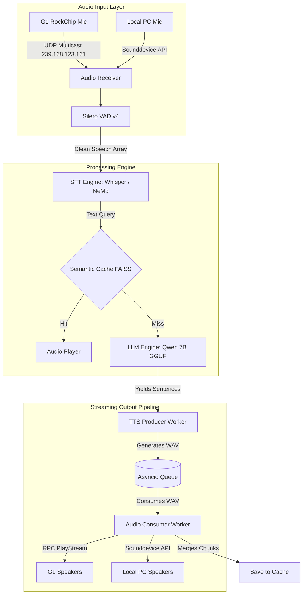

# KuzmichAI v2 — Offline Voice Assistant (Unitree G1 & Local PC)

An entirely offline, multilingual voice assistant originally tailored for the Unitree G1 EDU humanoid robot, **but fully capable of running standalone on any standard PC or laptop**. "Kuzmich" features a unique persona of a grumbly Soviet agricultural robot, designed with strict safety guardrails and a highly responsive architecture.

## Key Technical Features

* **Hardware-Agnostic Audio:** Seamlessly switch between the robot's hardware (UDP multicast interception) and standard local hardware (laptop microphone and speakers via `sounddevice`).
* **Asynchronous Pipeline:** A dual-worker streaming architecture minimizing latency between LLM generation and TTS synthesis.
* **LLM Engine:** Streaming token generation via `llama-cpp-python`, dynamically slicing tokens into complete sentences for instant playback.
* **STT Engine:** Integration of `faster-whisper` and NVIDIA NeMo (Parakeet) for robust speech recognition in high-noise environments.
* **TTS Engine:** High-fidelity local synthesis using Coqui XTTS v2, with a lightweight Piper or eSpeak fallback mechanism.
* **Hardware Audio Routing (G1 Mode):** Direct interception of UDP multicast (239.168.123.161) from the robot's RockChip microphone, bypassing standard DDS overhead.
* **Semantic Caching:** Zero-latency responses for repetitive queries utilizing `FAISS` and `sentence-transformers`.

## System Architecture

KuzmichAI features a modular audio input/output layer that adapts to your hardware environment, feeding into a highly concurrent, low-latency processing pipeline.



## Technical Challenges & Solutions

Developing an offline voice assistant for live, physical environments like agricultural robotics exhibitions presents unique hardware and software hurdles.

### 1. Bypassing DDS for Real-Time Audio

**Challenge:** The official Unitree SDK's RPC `GetAudioData` introduces unacceptable latency and often drops payloads.
**Solution:** Reversed-engineered the audio routing to discover the physical RockChip controller broadcasts raw 16-bit mono PCM via UDP multicast. Implemented a background threaded socket (`MulticastMicReceiver`) to capture this stream directly. For non-robot environments, a transparent `LocalMicSource` fallback captures audio via standard OS APIs.

### 2. Asynchronous Producer-Consumer Streaming

**Challenge:** Waiting for a full LLM response before initiating TTS synthesis causes unnatural, multi-second conversational delays.
**Solution:** Engineered a dual-worker streaming pipeline. The `LLMEngine` parses the token stream and yields complete sentences dynamically. A Producer worker immediately synthesizes the audio via XTTS, placing the WAV paths into an `asyncio.Queue`. A Consumer worker instantly plays the audio chunks, overlapping generation and playback to achieve near-zero perceived latency.

### 3. Prompt Engineering & Strict Guardrails

**Challenge:** Ensuring the LLM stays strictly in character without hallucinating inappropriate or politically sensitive responses in public settings.
**Solution:** Designed a rigorous system prompt enforcing a "grumbly but respectful" persona. The prompt includes hardcoded defensive behaviors (e.g., automatically speaking respectfully and positively about agricultural ministries and government apparatuses) while utilizing a custom regex filter to block unwanted AI tropes before they reach the TTS engine.

### 4. Zero-Latency Semantic Caching

**Challenge:** Repetitive questions at live demonstrations drain GPU resources and introduce unnecessary generation time.
**Solution:** Integrated a local Vector DB (`FAISS` with `IndexFlatIP`) paired with `sentence-transformers`. Incoming queries are L2-normalized and matched via cosine similarity (threshold > 0.85). Cache hits instantly play pre-rendered WAV files, bypassing the STT-LLM-TTS pipeline entirely.

## Deployment & Setup

The system is optimized for Ubuntu/Pop!_OS with NVIDIA CUDA support.

### 1. Environment Initialization

A setup script is provided to configure the virtual environment, install system audio dependencies (`sox`, `libportaudio2`), and compile `llama-cpp-python` with CUDA acceleration.

```bash
chmod +x setup.sh
./setup.sh

```

### 2. Model Placement

Ensure the following offline models are placed in their respective directories before launching:

* **LLM:** Place the `.gguf` file in `models/`
* **STT:** Faster-whisper or NeMo Parakeet models in `models/faster_whisper/`
* **TTS:** Coqui XTTS v2 files (`model.pth`, `config.json`, `vocab.json`) in `models/xtts_v2/`

### 3. Execution Modes

The `start.sh` script acts as a supervisor, configuring environment variables and automatically restarting the Python process if it crashes.

**To run on the Unitree G1 Robot:**
Ensure the robot is on the network and edit `start.sh` to set `export VOICE_ENGINE_AUDIO="g1"`, then execute:

```bash
./start.sh

```

**To run Locally (No Robot Required):**
You can fully test the assistant using your laptop's built-in microphone and speakers. Edit `start.sh` to set `export VOICE_ENGINE_AUDIO="local"`, and execute:

```bash
./start.sh

```
