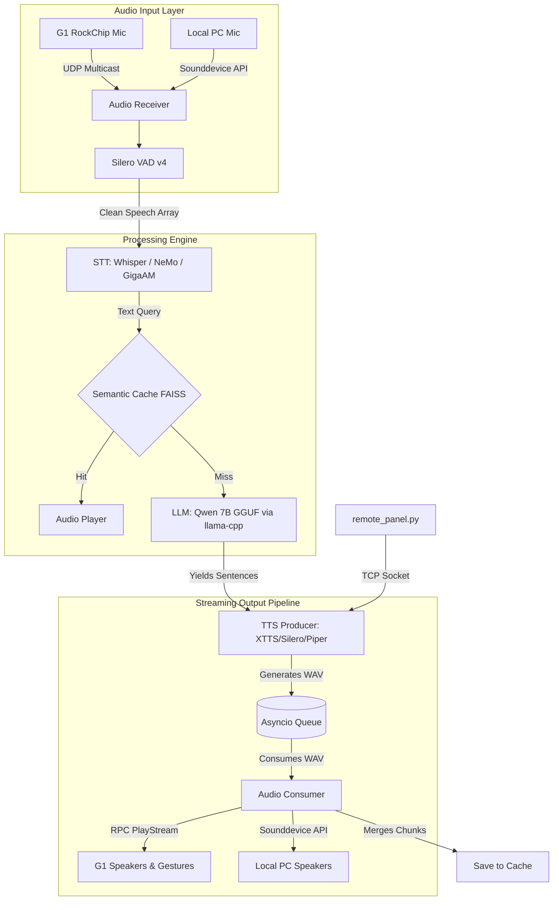

# KuzmichAI v2 — Offline Voice Assistant (Unitree G1 & Local PC)

An entirely offline, multilingual voice assistant originally tailored for the Unitree G1 EDU humanoid robot, **but fully capable of running standalone on any standard PC or laptop**. "Kuzmich" features a unique persona of a grumbly Soviet agricultural robot, designed with strict safety guardrails, a highly responsive architecture, and a few hidden surprises.

## Key Technical Features

* **Hardware-Agnostic Audio:** Seamlessly switch between the robot's hardware (UDP multicast interception) and standard local hardware (laptop microphone and speakers via `sounddevice`).
* **Asynchronous Streaming Pipeline:** A dual-worker architecture minimizing latency. The LLM streams tokens, slices them into sentences, and feeds them to the TTS engine, which plays audio chunks instantly.
* **Hybrid STT Engine:** Supports `faster-whisper`, NVIDIA NeMo (Parakeet) for noisy environments, and a **Hybrid mode (Whisper + GigaAM)** optimized for flawless Russian speech recognition.
* **Multi-Backend TTS Engine:** High-fidelity local synthesis using **Coqui XTTS v2** for multi-lang, **Silero TTS v5 (with ruaccent-predictor)** for native-quality Russian, and Piper / eSpeak as lightweight fallbacks.
* **Semantic Caching (FAISS):** Zero-latency responses for repetitive queries utilizing a vector database and `sentence-transformers`. Pre-build answers with `build_kb_cache.py`.
* **Wizard of Oz (Operator Console):** A built-in TCP server and remote panel (`remote_panel.py`) allowing a human operator to inject speech and trigger robot gestures in real-time.
* **Secret "Aunt Vasya" Protocol:** An uncensored, aggressive alter-ego mode that bypasses safety guardrails, activated via specific voice triggers.

## System Architecture

KuzmichAI features a modular audio input/output layer that adapts to your hardware environment, feeding into a highly concurrent, low-latency processing pipeline.



## Project Structure

```text
├── main.py                  # Main async event loop and pipeline orchestrator
├── audio_io.py              # Mic listeners and audio players (G1 UDP & Local)
├── llm_engine.py            # LLM streaming and prompt/persona management
├── stt_engine.py            # STT router (Whisper, NeMo, Hybrid GigaAM)
├── tts_engine.py            # TTS router (XTTS, Silero, Piper, eSpeak)
├── semantic_cache.py        # Vector database management (FAISS)
├── build_kb_cache.py        # Script to pre-synthesize responses from kb_dump.json
├── remote_panel.py          # Operator console for remote control (Wizard of Oz)
├── analyze_for_tts.py       # VLM integration for scene analysis 
├── g1_greeting_gestures.py  # Unitree G1 gesture controller mapping
├── start.sh                 # Supervisor script to run the assistant
├── setup.sh                 # Environment setup and dependencies installation
├── models/                  # Directory for downloaded ML models (ignored in git)
└── cache_audio/             # Generated audio cache (ignored in git)

```

## Deployment & Setup

The system is optimized for Ubuntu/Pop!_OS with NVIDIA CUDA support.

### 1. Environment Initialization

A setup script is provided to configure the virtual environment, install system audio dependencies (`sox`, `libportaudio2`), and compile `llama-cpp-python` with CUDA acceleration.

```bash
chmod +x setup.sh
./setup.sh

```

### 2. Model Placement

Ensure the following offline models are placed in the `models/` directory before launching:

* **LLM:** `.gguf` file (e.g., Qwen2.5).
* **STT:** Faster-whisper, NeMo Parakeet, or GigaAM ONNX models.
* **TTS:** Coqui XTTS v2 files (`model.pth`, `config.json`, `vocab.json`). Silero models are downloaded automatically via PyTorch Hub.

### 3. Execution Modes

The `start.sh` script acts as a supervisor, configuring environment variables and automatically restarting the Python process if it crashes.

**To run on the Unitree G1 Robot:**
Ensure the robot is on the network and edit `start.sh` to set `export VOICE_ENGINE_AUDIO="g1"`, then execute:

```bash
./start.sh

```

**To run Locally (No Robot Required):**
You can fully test the assistant using your laptop's built-in microphone and speakers. Edit `start.sh` to set `export VOICE_ENGINE_AUDIO="local"`, and execute:

```bash
./start.sh

```

### 4. Operator Console (Wizard of Oz)

While the main assistant is running, open a new terminal and launch the remote panel to inject custom speech and gestures:

```bash
python remote_panel.py
# Try typing: /en [gesture: shakehands] Hello, it is nice to meet you!

```
