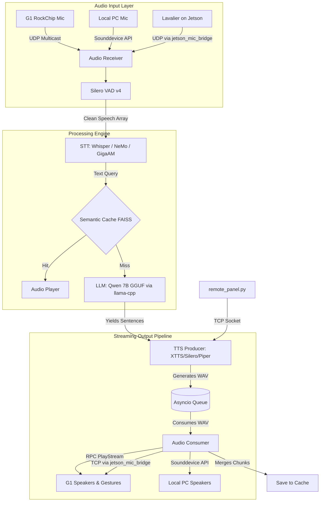

# KuzmichAI v2 — Offline Voice Assistant (Unitree G1 & Local PC)

An entirely offline, multilingual voice assistant originally tailored for the Unitree G1 EDU humanoid robot, **but fully capable of running standalone on any standard PC or laptop**. "Kuzmich" features a unique persona of a grumbly Soviet agricultural robot, designed with strict safety guardrails, a highly responsive architecture, and a few hidden surprises.

## Key Technical Features

* **Hardware-Agnostic Audio:** Seamlessly switch between the robot's hardware (UDP multicast interception) and standard local hardware (laptop microphone and speakers via `sounddevice`).
* **External Mic on the Robot (`g1_extmic`):** Plug a lavalier into the G1's Jetson via a USB sound card and run all the heavy ML on a laptop. A tiny bridge (`jetson_mic_bridge.py`) streams the mic to the laptop and plays the answers on the robot speaker, over Wi-Fi, authenticated with a pre-shared key.
* **Asynchronous Streaming Pipeline:** A dual-worker architecture minimizing latency. The LLM streams tokens, slices them into sentences, and feeds them to the TTS engine, which plays audio chunks instantly.
* **Hybrid STT Engine:** Supports `faster-whisper`, NVIDIA NeMo (Parakeet) for noisy environments, and a **Hybrid mode (Whisper + GigaAM)** optimized for flawless Russian speech recognition.
* **Multi-Backend TTS Engine:** High-fidelity local synthesis using **Coqui XTTS v2** for multi-lang, **Silero TTS v5 (with ruaccent-predictor)** for native-quality Russian, and Piper / eSpeak as lightweight fallbacks.
* **Semantic Caching (FAISS):** Zero-latency responses for repetitive queries utilizing a vector database and `sentence-transformers`. Pre-build answers with `build_kb_cache.py`.
* **Wizard of Oz (Operator Console):** A built-in TCP server and remote panel (`remote_panel.py`) allowing a human operator to inject speech and trigger robot gestures in real-time.
* **Secret "Aunt Vasya" Protocol:** An uncensored, aggressive alter-ego mode that bypasses safety guardrails, activated via specific voice triggers.

## System Architecture

KuzmichAI features a modular audio input/output layer that adapts to your hardware environment, feeding into a highly concurrent, low-latency processing pipeline.


```mermaid
graph TD
    subgraph Input [Audio Input Layer]
        M1[G1 RockChip Mic] -- UDP Multicast --> UDP[Audio Receiver]
        M2[Local PC Mic] -- Sounddevice API --> UDP
        M3[Lavalier on Jetson] -- UDP via jetson_mic_bridge --> UDP
        UDP --> VAD[Silero VAD v4]
    end

    subgraph Core [Processing Engine]
        VAD -- Clean Speech Array --> STT[STT: Whisper / NeMo / GigaAM]
        STT -- Text Query --> Cache{Semantic Cache FAISS}
        Cache -- Hit --> Play[Audio Player]
        Cache -- Miss --> LLM[LLM: Qwen 7B GGUF via llama-cpp]
    end

    subgraph AsyncPipeline [Streaming Output Pipeline]
        LLM -- Yields Sentences --> Worker1[TTS Producer: XTTS/Silero/Piper]
        Worker1 -- Generates WAV --> Queue[(Asyncio Queue)]
        Queue -- Consumes WAV --> Worker2[Audio Consumer]
        Worker2 -- RPC PlayStream --> Robot1[G1 Speakers & Gestures]
        Worker2 -- Sounddevice API --> Robot2[Local PC Speakers]
        Worker2 -- TCP via jetson_mic_bridge --> Robot1
    end
    
    Worker2 -- Merges Chunks --> CacheWrite[Save to Cache]
    OpPanel[remote_panel.py] -- TCP Socket --> Worker1

```

## Project Structure

```text
├── main.py                  # Main async event loop and pipeline orchestrator
├── audio_io.py              # Mic listeners and audio players (G1 UDP & Local)
├── ext_mic.py               # g1_extmic mode: laptop side of the Jetson mic bridge
├── jetson_mic_bridge.py     # g1_extmic mode: runs on the robot's Jetson (stdlib only)
├── deploy_jetson_bridge.sh  # Copies the bridge + key to the robot and starts it
├── G1_EXTMIC.md             # g1_extmic setup guide and troubleshooting
├── llm_engine.py            # LLM streaming and prompt/persona management
├── stt_engine.py            # STT router (Whisper, NeMo, Hybrid GigaAM)
├── tts_engine.py            # TTS router (XTTS, Silero, Piper, eSpeak)
├── semantic_cache.py        # Vector database management (FAISS)
├── build_kb_cache.py        # Script to pre-synthesize responses from kb_dump.json
├── remote_panel.py          # Operator console for remote control (Wizard of Oz)
├── analyze_for_tts.py       # VLM integration for scene analysis 
├── g1_greeting_gestures.py  # Unitree G1 gesture controller mapping
├── start.sh                 # Supervisor script to run the assistant
├── setup.sh                 # One-shot installer: system packages, venv, deps and all models
├── models/                  # Directory for downloaded ML models (ignored in git)
└── cache_audio/             # Generated audio cache (ignored in git)

```

## Deployment & Setup

The system is optimized for Ubuntu/Pop!_OS (tested on Pop!_OS 24.04) with an NVIDIA GPU. The full pipeline (LLM + XTTS + Whisper) uses about 9-10 GB of VRAM.

### 1. Installation

On a fresh machine a single command installs everything:

```bash
git clone https://github.com/ArtZap/KuzmichAI-UnitreeG1.git KuzmichAI
cd KuzmichAI
./setup.sh

```

`setup.sh` is safe to re-run (finished steps are skipped) and:

* installs missing system packages (`sudo` is only asked for when something is missing) and creates a Python 3.11 venv;
* picks the PyTorch build for your NVIDIA driver (CUDA 13, CUDA 12.6, or CPU-only without a GPU);
* installs `llama-cpp-python` with CUDA: built from source when `nvcc` is present, otherwise a prebuilt CUDA 12.4 wheel, so no CUDA toolkit is required;
* installs the pinned, tested dependency set from `requirements.txt`;
* downloads every model the assistant needs, because `start.sh` runs offline (`HF_HUB_OFFLINE=1`).

### 2. Models

`setup.sh` downloads the models into `models/` (and Piper voices into `~/.local/share/piper/`):

* **LLM:** Saiga Llama 3 8B Q4_K_M, saved as `models/model-q4_K_M.gguf`. To use another GGUF (e.g., Qwen2.5), put it into `models/` and point `VOICE_ENGINE_LLM_MODEL` in `start.sh` at it.
* **STT:** faster-whisper `large-v3-turbo`. NeMo is optional and not installed by default (`pip install "nemo_toolkit[asr]"` for `VOICE_ENGINE_STT_BACKEND=nemo`).
* **TTS:** Coqui XTTS v2, Silero TTS + ruaccent for Russian, Piper voices as a fallback.
* **Other:** the `sentence-transformers` embedder for the semantic cache and Silero VAD.

The start-up phrases (`startup.wav`, `scanning.wav`) are synthesized on the first run with the current voice. Delete them to re-voice them after changing the voice or the text.

### 3. Execution Modes

The `start.sh` script acts as a supervisor, configuring environment variables and automatically restarting the Python process if it crashes. The audio mode comes from `VOICE_ENGINE_AUDIO` (default `local`); it can be set on the command line without editing the script.

**To run Locally (No Robot Required):**
You can fully test the assistant using your laptop's built-in microphone and speakers:

```bash
./start.sh

```

**To run on the Unitree G1 Robot:**
Ensure the robot is on the network, then execute:

```bash
VOICE_ENGINE_AUDIO=g1 ./start.sh

```

**To run on a laptop with a lavalier plugged into the robot (`g1_extmic`):**
Connect the lavalier to the Jetson through an *active* USB sound card, put the robot and the laptop on the same network, then run on the laptop:

```bash
./deploy_jetson_bridge.sh unitree@192.168.1.103   # once per robot boot; asks the robot's SSH password
VOICE_ENGINE_AUDIO=g1_extmic VOICE_ENGINE_ROBOT_IP=192.168.1.103 ./start.sh

```

The bridge auto-detects the USB sound card and plays answers with `g1_audio_play`. Set `VOICE_ENGINE_EXTMIC_PLAYER=local` to hear the answers on the laptop instead (handy for testing the mic). Details, settings and troubleshooting: [G1_EXTMIC.md](G1_EXTMIC.md).

### 4. Operator Console (Wizard of Oz)

While the main assistant is running, open a new terminal and launch the remote panel to inject custom speech and gestures:

```bash
python remote_panel.py
# Try typing: /en [gesture: shakehands] Hello, it is nice to meet you!

```
